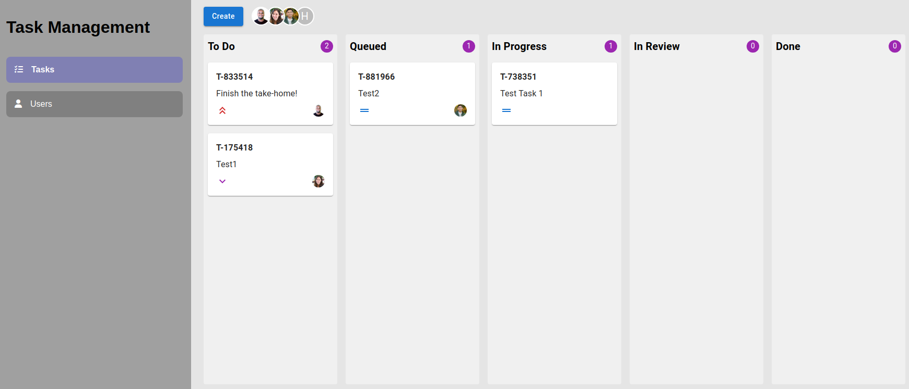

# Task Board

## Description
Task-app is a simple task management application designed to help users organize and manage their tasks efficiently.

### Task Management
- Add, edit, and delete tasks
- Mark tasks as completed
- Filter tasks by status (completed, pending)
- User-friendly interface

### User Management
- Manage user profiles
- Assign tasks to specific users

## Installation
1. Clone the repository:
  ```bash
  git clone https://github.com/smartgru/task-board.git
  ```
2. Navigate to the project directory:
  ```bash
  cd task-app
  ```
3. Install dependencies:
  ```bash
  yarn install
  ```
### Screenshot


## Usage
1. Start the development server:
  ```bash
  yarn start
  ```
2. Open your browser and navigate to `http://localhost:5173`

## Contributing
Contributions are welcome! Please fork the repository and submit a pull request.

## License
This project is licensed under the MIT License.